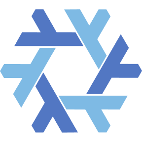
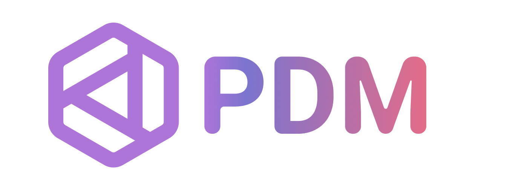
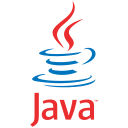
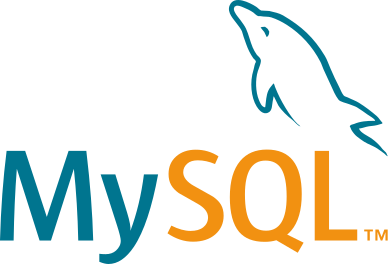
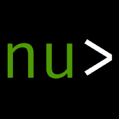
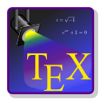
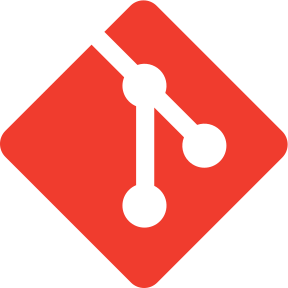

<!--
2024-09-18
 -->

<!--

latest commit id: 2f0ab29740 ('24-09-19)
https://raw.githubusercontent.com/github/explore/main/topics/nodejs/nodejs.png

<link rel="stylesheet" type='text/css'
  href="https://cdn.jsdelivr.net/gh/devicons/devicon@latest/devicon.min.css"
/>

<i class="devicon-c-plain colored"></i> <i class="devicon-cplusplus-plain colored"></i>

  -->

<h1 align="center">🌻🌺 Welcome to this profile 🪷🌹</h1>

## Github Public Stats for this profile

> [!NOTE]
> * The following autogenerated stats are only about this github profile & that too, just the public contributions.
> * Github is only just _one_ of the various online source hosting / source forging sites.

[user-lang-info]: https://github.com/orgs/community/discussions/18230

* Upvote this [request to github][user-lang-info] to see the language-wise distribution of my commits 😃

 

&nbsp;

  <!-- align="center" float:center; -->

<!--
* The width of the github profile readme is 780px
* ( 5 * 2 ) * 2 = 10px in margins
* 372 + 300 = 672px in image
 -->

&nbsp;

&nbsp;
<a
  href="https://git.io/streak-stats"
  aria-details="https://github-readme-streak-stats.herokuapp.com/demo/"
>
  
  <!-- Default Streak Stats width is 495px -->
</a>

## Tech Stacks Used:

### General Purpose Programming:

* Mainly logic, and CLI applications.
* Occassionally done GUI: Swing in Java, Streamlit in python.

<table>

<thead>
<tr>
  <th>Core ⚙</th> <th>Build Spec 🏗</th> <th>Deps ⏬🧳</th> <th>Test ✔</th> <th>Proto 🏃‍♀️‍➡️</th> <th>Dev Tools 🛠</th>
</tr>
</thead>

<tbody>

<tr>
  <td>
    <!--  -->
    
    

  </td>
  <td> Makefile,
    
    , 
  </td>
  <td>   </td>
  <td>   </td>
  <td>
    <a title="Cling - ROOT https://root.cern/cling/" href="https://rawcdn.githack.com/root-project/cling/master/www/index.html"/>Cling</a>
  </td>
  <td>
    
    , <a title="🐛 LLDB" href="https://lldb.llvm.org/"/>LLDB</a>
    , 
  </td>
</tr>

<tr>
  <td>
    
  </td>
  <td>
    <a title="Python Project TOML Config File" href="https://packaging.python.org/en/latest/specifications/pyproject-toml/"/> pyproject.toml</a>
    <!-- href="https://pip.pypa.io/en/stable/reference/build-system/pyproject-toml/" -->
    , 
  </td>
  <td>
    
    , 
  </td>
  <td>
    
  </td>
  <td>
    
  </td>
  <td>
    <a title="CPython Python Implementation" href="https://www.python.org/download/alternatives/"/>CPython</a>
    , 
    , 
    , <a title="pdbplus · PyPI" href="https://pypi.org/project/pdbplus/"/>Pdb+</a>
  </td>
</tr>

<tr>
  <td>
    
  </td>
  <td>
    <a title="Maven – POM Reference" href="https://maven.apache.org/pom.html"/> POM.xml</a>
  </td>
  <td>
    
  </td>
  <td>   </td>
  <td>
    <a title="Introduction to JShell" href="https://docs.oracle.com/en/java/javase/21/jshell/introduction-jshell.html"/>JShell</a>
  </td>
  <td>
    
    
  </td>
</tr>

</tbody>

</table>

### Server-Side Programming:

[RFC 2616]: http://www.w3.org/Protocols/rfc2616/rfc2616-sec5.html "HTTP/1.1: Request"
[RFC 9110]: https://www.rfc-editor.org/rfc/rfc9110.html "RFC 9110: HTTP Semantics"

Common tools used:

*  CLI tool for `GET` requests

* REST Client for `POST` requests with [RFC 2616] standard \
  vscode-extension-id: `humao.rest-client`

<!--
* httpYac - Rest Client: vscode-extension-id: `anweber.vscode-httpyac`

* Thunder Client: vscode-extension-id: `rangav.vscode-thunder-client`
 -->

<table>

<thead>
<tr>
  <th>Core ⚙</th> <th>Server 📡</th> <th>Templating 📋</th>
</tr>
</thead>

<tbody>

<tr>
  <td>
    
  </td>
  <td>
    
  </td>
  <td>
    
  </td>
</tr>

<tr>
  <td>
    
    
  </td>
  <td>
    
  </td>
  <td>
  </td>
</tr>

</tbody>

</table>

### Domain Specific Technologies:

<table>

<thead>
<tr>
  <th></th> <th>Core ⚙</th> <th>Tools 🛠🧰</th>
</tr>
</thead>

<tbody>

<tr>
  <td> Client-side WebApps  </td>
  <td>
    
    
    
  </td>
  <td>
    
    
    , 
  </td>
</tr>

<tr>
  <td> DBMS Database  </td>
  <td>
    
    
  </td>
  <td> Respective Shells, MySQL Workbench  </td>
</tr>

<tr>
  <td> Flat-file semi-structured DB  </td>
  <td>
    
    
    
  </td>
  <td>
    
    , <a title="yq YAML Processor" href="https://mikefarah.gitbook.io/yq"/>yq</a>
    , 
  </td>
  <td>  </td>
</tr>

<tr>
  <td> Markup  </td>
  <td>
    
    
    , 
    , 
  </td>
  <td>
    
    , 
    , <a title="TeX Live - TeX Users Group" href="https://tug.org/texlive/"/>Tex Live</a>
  </td>
</tr>

<tr>
  <td> DevOps  </td>
  <td>
    
    
    
    
  </td>
  <td>
    <a title="bash_kernel · PyPI" href="https://pypi.org/project/bash_kernel/"/>Jupyter (IBash)</a>
    <!-- , <a title="nix eval - Nix Reference Manual" href="https://nix.dev/manual/nix/latest/command-ref/new-cli/nix3-eval.html"/>nix eval</a> -->
    , <a title="Nix language basics — nix.dev documentation" href="https://nix.dev/tutorials/nix-language.html#interactive-evaluation"/>nix eval</a>
  </td>
</tr>

</tbody>

</table>
